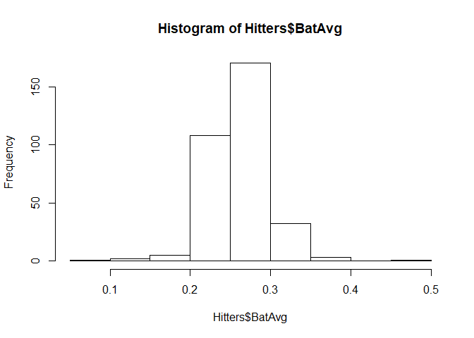
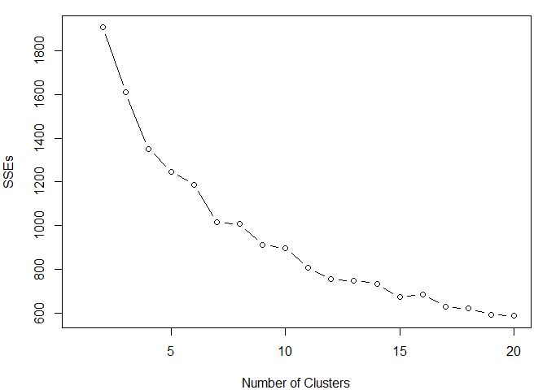
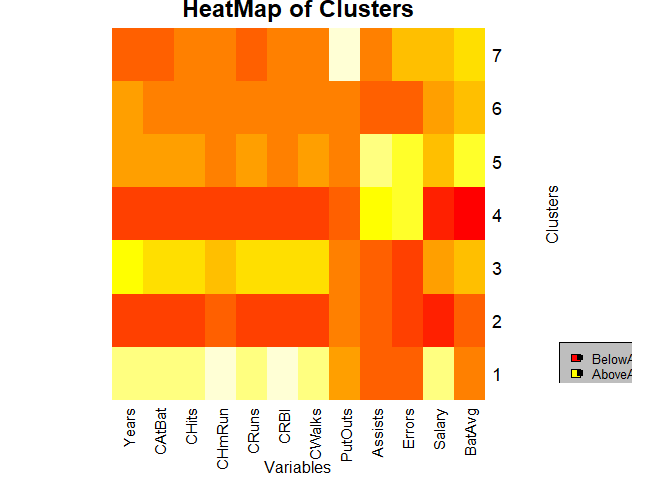
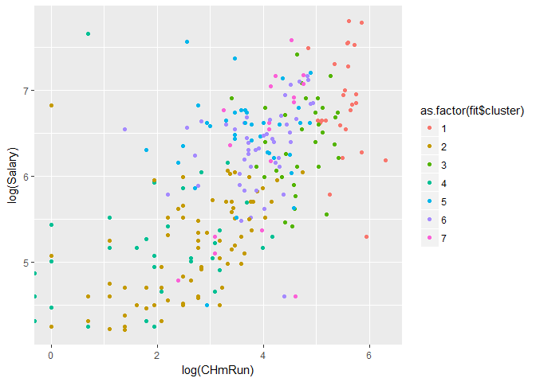
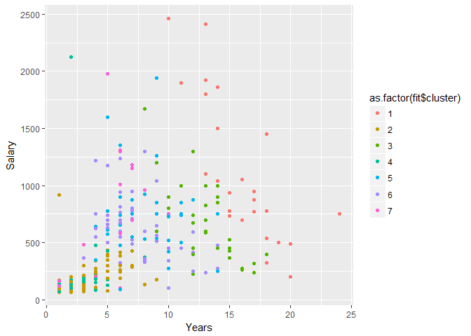

Hiters Clustering - Post 1
================
Tanner Martin
November 29, 2018

BASEBALL HITTERS CLUSTERING - POST 2
------------------------------------

GET A SUMMARY OF THE DATA TO EXPLORE THE DATA - LOOKS MOST OF THE DATA IS NUMERIC EXCEPT FOR PLAYER NAMES.THIS DATA IS PROBABLY VERY USEFUL TO CREATE MEANINGUL CLUSTERS OF PLAYERS THAT WE CAN "DESCRIBE"

``` r
Hitters <- read.csv("Hitters.csv")
summary(Hitters)
```

    ##      AtBat            Hits         HmRun            Runs       
    ##  Min.   : 16.0   Min.   :  1   Min.   : 0.00   Min.   :  0.00  
    ##  1st Qu.:255.2   1st Qu.: 64   1st Qu.: 4.00   1st Qu.: 30.25  
    ##  Median :379.5   Median : 96   Median : 8.00   Median : 48.00  
    ##  Mean   :380.9   Mean   :101   Mean   :10.77   Mean   : 50.91  
    ##  3rd Qu.:512.0   3rd Qu.:137   3rd Qu.:16.00   3rd Qu.: 69.00  
    ##  Max.   :687.0   Max.   :238   Max.   :40.00   Max.   :130.00  
    ##                                                                
    ##       RBI             Walks            Years            CAtBat       
    ##  Min.   :  0.00   Min.   :  0.00   Min.   : 1.000   Min.   :   19.0  
    ##  1st Qu.: 28.00   1st Qu.: 22.00   1st Qu.: 4.000   1st Qu.:  816.8  
    ##  Median : 44.00   Median : 35.00   Median : 6.000   Median : 1928.0  
    ##  Mean   : 48.03   Mean   : 38.74   Mean   : 7.444   Mean   : 2648.7  
    ##  3rd Qu.: 64.75   3rd Qu.: 53.00   3rd Qu.:11.000   3rd Qu.: 3924.2  
    ##  Max.   :121.00   Max.   :105.00   Max.   :24.000   Max.   :14053.0  
    ##                                                                      
    ##      CHits            CHmRun           CRuns             CRBI        
    ##  Min.   :   4.0   Min.   :  0.00   Min.   :   1.0   Min.   :   0.00  
    ##  1st Qu.: 209.0   1st Qu.: 14.00   1st Qu.: 100.2   1st Qu.:  88.75  
    ##  Median : 508.0   Median : 37.50   Median : 247.0   Median : 220.50  
    ##  Mean   : 717.6   Mean   : 69.49   Mean   : 358.8   Mean   : 330.12  
    ##  3rd Qu.:1059.2   3rd Qu.: 90.00   3rd Qu.: 526.2   3rd Qu.: 426.25  
    ##  Max.   :4256.0   Max.   :548.00   Max.   :2165.0   Max.   :1659.00  
    ##                                                                      
    ##      CWalks        League  Division    PutOuts          Assists     
    ##  Min.   :   0.00   A:175   E:157    Min.   :   0.0   Min.   :  0.0  
    ##  1st Qu.:  67.25   N:147   W:165    1st Qu.: 109.2   1st Qu.:  7.0  
    ##  Median : 170.50                    Median : 212.0   Median : 39.5  
    ##  Mean   : 260.24                    Mean   : 288.9   Mean   :106.9  
    ##  3rd Qu.: 339.25                    3rd Qu.: 325.0   3rd Qu.:166.0  
    ##  Max.   :1566.00                    Max.   :1378.0   Max.   :492.0  
    ##                                                                     
    ##      Errors          Salary       NewLeague
    ##  Min.   : 0.00   Min.   :  67.5   A:176    
    ##  1st Qu.: 3.00   1st Qu.: 190.0   N:146    
    ##  Median : 6.00   Median : 425.0            
    ##  Mean   : 8.04   Mean   : 535.9            
    ##  3rd Qu.:11.00   3rd Qu.: 750.0            
    ##  Max.   :32.00   Max.   :2460.0            
    ##                  NA's   :59

WE CAN CREATE A BATTING AVERAGE

``` r
Hitters$BatAvg <- Hitters$Hits/Hitters$AtBat
hist(Hitters$BatAvg)
```



I'M ONLY GOING TO CONSIDER NUMERICAL VARIABLES IN THIS CASE. WE ALSO, FOR SIMPLISITY SAKE, ARE GOING TO TAKE OUT ROWS WHERE WE HAVE MISSING VALUES

``` r
Hitters <- Hitters[,-c(14,15,20)]
Hitters <- Hitters[complete.cases(Hitters),]
```

WE HAVE DATA ON HITTERS FROM THIS PAST SEASON AS WELL OVER THE ENTIRETY OF THEIR CAREER. BECAUSE WE WANT TO GET A MORE HOLISITIC PICTURE OF THE PLAYERS AND HOW THEY HAVE SIMILARITIES, I'M GOING TO NOT INCLUDE ANY OF THE DATA ON THEIR PERFORMANCE RECENTLY AND JUST LOOK WHOLISTICLY AT THEIR CAREERS

``` r
names(Hitters)
```

    ##  [1] "AtBat"   "Hits"    "HmRun"   "Runs"    "RBI"     "Walks"   "Years"  
    ##  [8] "CAtBat"  "CHits"   "CHmRun"  "CRuns"   "CRBI"    "CWalks"  "PutOuts"
    ## [15] "Assists" "Errors"  "Salary"  "BatAvg"

``` r
Hitters <- Hitters[,-c(1:6)]
```

WE NEED TO SCALE THE DATA SO THAT BIGGER VARIABLE DIFFERENCES AREN'T DOMINATING THE ANALYSIS

``` r
Hitters.scale <- scale(Hitters)
summary(Hitters.scale)
```

    ##      Years             CAtBat            CHits             CHmRun       
    ##  Min.   :-1.3167   Min.   :-1.1539   Min.   :-1.1080   Min.   :-0.8424  
    ##  1st Qu.:-0.6909   1st Qu.:-0.7938   1st Qu.:-0.7871   1st Qu.:-0.6599  
    ##  Median :-0.2737   Median :-0.3177   Median :-0.3181   Median :-0.3557  
    ##  Mean   : 0.0000   Mean   : 0.0000   Mean   : 0.0000   Mean   : 0.0000  
    ##  3rd Qu.: 0.5608   3rd Qu.: 0.5392   3rd Qu.: 0.5119   3rd Qu.: 0.2830  
    ##  Max.   : 3.4813   Max.   : 4.9836   Max.   : 5.4517   Max.   : 5.8245  
    ##      CRuns              CRBI             CWalks           PutOuts       
    ##  Min.   :-1.0846   Min.   :-1.0125   Min.   :-0.9819   Min.   :-1.0385  
    ##  1st Qu.:-0.7721   1st Qu.:-0.7280   1st Qu.:-0.7168   1st Qu.:-0.6330  
    ##  Median :-0.3358   Median :-0.3105   Median :-0.3267   Median :-0.2383  
    ##  Mean   : 0.0000   Mean   : 0.0000   Mean   : 0.0000   Mean   : 0.0000  
    ##  3rd Qu.: 0.4115   3rd Qu.: 0.2909   3rd Qu.: 0.2584   3rd Qu.: 0.1136  
    ##  Max.   : 5.4462   Max.   : 4.1086   Max.   : 4.9449   Max.   : 3.8805  
    ##     Assists            Errors            Salary            BatAvg        
    ##  Min.   :-0.8186   Min.   :-1.3007   Min.   :-1.0384   Min.   :-6.62272  
    ##  1st Qu.:-0.7634   1st Qu.:-0.8466   1st Qu.:-0.7668   1st Qu.:-0.58864  
    ##  Median :-0.5084   Median :-0.2411   Median :-0.2459   Median :-0.01806  
    ##  Mean   : 0.0000   Mean   : 0.0000   Mean   : 0.0000   Mean   : 0.00000  
    ##  3rd Qu.: 0.5048   3rd Qu.: 0.6670   3rd Qu.: 0.4745   3rd Qu.: 0.51765  
    ##  Max.   : 2.5726   Max.   : 3.5430   Max.   : 4.2651   Max.   : 2.94075

NOW LETS DEPLOY K MEANS CLUSTERING ON THE DATA TO SEE IF WE CAN FIND ANYTHING INTERESTING. WHAT IS THE BEST NUMBER OF CLUSTERS TO USE? THERE'S NO RIGHT ANSWER HERE BUT WE CAN MAKE A GOOD GUESS BY LOOKING AT THEIR SSE AS THE NUMBER OF CLUSTERS GOES UP

``` r
#7 Could be a good number of clusters because there are roughly 8 players in a hitting lineup (excluding the pitcher here)
set.seed(700) ; fit <- kmeans(Hitters.scale,7)
fit$size
```

    ## [1] 25 75 32 32 35 47 17

``` r
#Now lets do a comprehensive approach to see what things look like for different k's
SSEs <- rep(NA,19) # a vector to store SSEs for different k's
for(k in 2:20){
    fit <- kmeans(Hitters.scale,k)
    SSEs[k] <- fit$tot.withinss
}
par(mar=c(4,4,1,1))

plot(1:20,SSEs,type="b",xlab="Number of Clusters")
```



I DON'T SEE A CUT AND DRY RIGHT ANSWER FOR THE NUMBER OF K LIKE I HAD HOPED TO SEE. THERE'SE REALLY NO "ELBOW" THAT PEOPLE TEND TO LOOK FOR WHEN DOING THIS. I THINK 10 IS A REASONABLE NUMBER HERE WITHOUT GETTING TOO COMPLICATED. THERE'S OFTEN A BALANCE BETWEEN PERFORMANCE AND INTERPRETABILITY WITH THIS BECAUSE THERE'S NO CUT AND DRY ANSWER. IT LOOKS LIKE 7 COULD BE A REASONABLE NUMBER OF CLUSTERS.

``` r
set.seed(700) ; fit <- kmeans(Hitters.scale,7)
fit$size
```

    ## [1] 25 75 32 32 35 47 17

``` r
fit$centers
```

    ##         Years     CAtBat       CHits      CHmRun      CRuns        CRBI
    ## 1  1.79576609  2.0878737  2.11609757  2.38401730  2.1626285  2.41341923
    ## 2 -0.77153735 -0.8301749 -0.81982917 -0.58622419 -0.7867401 -0.75148180
    ## 3  1.20617985  1.0686880  1.03117526  0.64681594  1.0220401  0.84903510
    ## 4 -0.84733261 -0.7912106 -0.79595279 -0.67811659 -0.7865426 -0.76976852
    ## 5  0.15548926  0.3018349  0.30186816 -0.22746030  0.2486451  0.03475577
    ## 6  0.05479809 -0.0892864 -0.09961328 -0.12198385 -0.1227242 -0.10959515
    ## 7 -0.38409394 -0.3047507 -0.28387834 -0.05515565 -0.3253334 -0.15155036
    ##       CWalks    PutOuts    Assists     Errors     Salary     BatAvg
    ## 1  2.1044556  0.3266798 -0.3821356 -0.2956382  1.2783525 -0.0323869
    ## 2 -0.7034856 -0.1997765 -0.6301817 -0.5479122 -0.7358825 -0.2654831
    ## 3  0.9734544 -0.2841906 -0.4982866 -0.5438758  0.3001477  0.2449085
    ## 4 -0.7269434 -0.4853537  1.1729830  1.2251954 -0.6381563 -0.8250582
    ## 5  0.1190965 -0.2397383  1.6917464  1.1211324  0.4432940  0.6251101
    ## 6 -0.1693315 -0.1363098 -0.4645608 -0.4730244  0.2075133  0.2414791
    ## 7 -0.2322425  2.7199449 -0.1264724  0.5690976  0.5164841  0.3563132

WE CAN VIEW A HEAT MAP OF THE CLUSTERS WHICH CAN ALLOW US TO LOOK AT THINGS VISUALLY INSTEAD OF METHODICALLY LOOKING AT THE NUMBERS

``` r
clusters <- fit$centers
HM <- heatmap(clusters, Rowv=NA, Colv=NA, scale="column", main="HeatMap of Clusters", 
              xlab = "Variables",ylab = "Clusters")
legend("topleft", legend=c("BelowAvg", "AboveAvg"),
       fill=c("red", "Yellow"),pch=15 ,cex=0.8, bg=c("grey"), horiz=F, inset=.87)
```



CAN WE DESCRIBE THE CLUSTERS? IS THERE ANYTHING INTERESTING HERE THAT IS APPARENT?

CLUSTER 1 - APPEARS TO BE PLAYERS THAT HAVE PLAYED A LONG TIME WHO HAVE A LARGE NUMBER OF AT BATS AND HENCE NUMBER OF HITS, HMRUNS, ETC. THESE HITTERS LOOK TO BE MORE POWER HITTERS (A LOT OF HOMERUNS THAN ANY OTHER GROUP). THEY HAVE A LOWER BATTING AVERAGE WHICH MAKES SENSE (POWER HITTERS TEND TO STRIKE OUT MORE)

CLUSTER 2 - YOUNGER PLAYERS THAT SEEM TO BE GOOD AT FIELDING (NOT AS MANY ERRORS). HOWEVER, THIS GROUP IS A DECENT HITTING HITTING GROUP ALTHOUGH THEY HAVEN'T PLAYED FOR A VERY LONG TIME

CLUSTER 3 - THESE ARE THE THIRD OLDEST GROUP OF PLAYERS (COMPARED TO CLUSTER 1 AND 6) AND THIS GROUP HAS A HIGH BATTING AVERAGE (HIGHEST OUT OF ALL GROUPS). THEY HAVE ABOVE AVERAGE CAREER STATS BECASE OF HOW LONG THEY'VE BEEN PLAYING

CLUSTER 4 - THIS GROUP IS A YOUNG GROUP WITH A LOT OF ERRORS. OVERALL, THIS IS THE WORST GROUP. THEY ARE YOUNG, HAVE ABOVER AVERAGE ERRORS, AND BELOW AVERAGE BATTING AVERAGE

CLUSTER 5 - YOUNGER PLAYERS SO THEY NATURALLY HAVE A LOWER AMOUNT OF CAREER HITTING STATS. THEY HAVE A VERY GOOD BATTING AVERAGE COMPARED TO THE OVERALL POPULATION BUT HIGHER AMOUNT OF ERRORS (WHICH IS A BAD THING!)

CLUSTER 6 - THIS GROUP IS PRETTY MIDDLE OF THE ROAD OVERALL - THIS COULD POSSIBLY BE GROUP OF BACKUPS WHO AREN'T ALLSTARS BUT A GOOD WHEN THEY NEED TO FILL IN

CLUSTER 7 - A GROUP SIMILAR TO CLUSTER 6 THE BIGGEST DIFFERENCE WITH THIS GROUP IS THAT THEY HAVE A HIGHER BATTING AVERAGE OVERALL AND ARE SLIGHTLY OLDER WITH MORE ERRORS

LETS EXPLORE THESE CLUSTERS A LITTLE FUTHER. CLUSTER 6 IS OLDER PLAYERS THAT LOOK TO BE VERY SUCCESFUL AND CLUSTER 7 LOOKS TO BE RELATIVELY BAD

``` r
par(mar=c(4,4,1,1))
library(ggplot2)

ggplot(Hitters,aes(x=log(CHmRun),y=log(Salary), color=as.factor(fit$cluster))) + geom_point()
```



``` r
# It looks like Career Home Runs is strongly positively correlated with Salary. It looks like there's a clear divde among the clusters on thise graph. Cluster 1 (the old power hitters) are typically getting a higher salary and also hit more homeruns.

ggplot(Hitters,aes(x=Years,y=Salary, color=as.factor(fit$cluster))) + geom_point()
```


