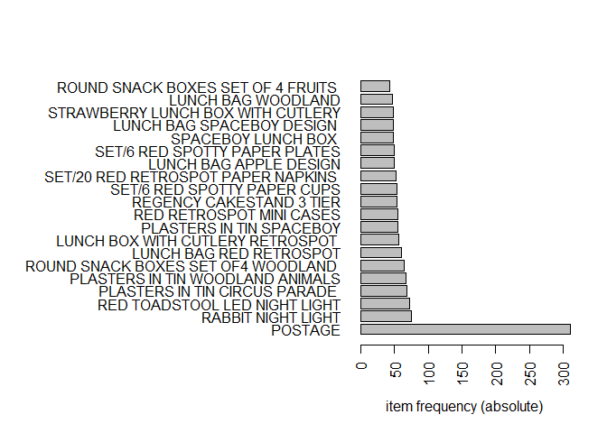
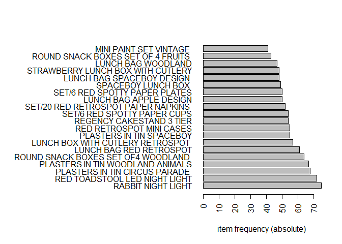
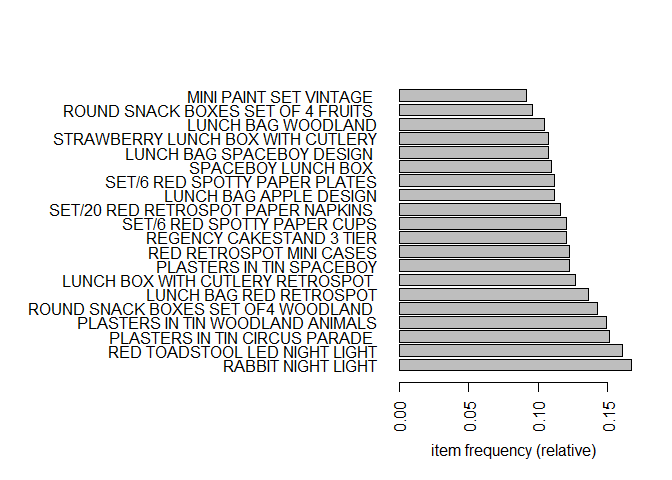
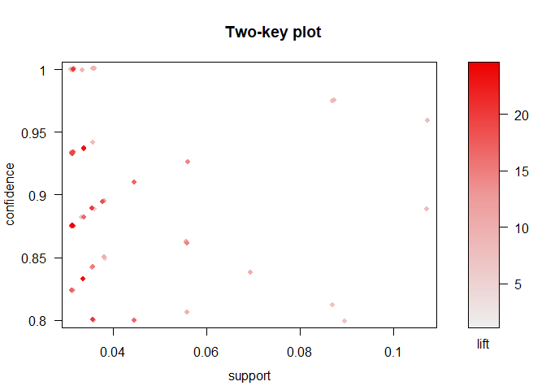

Online Retail - Post1
================
Tanner Martin
November 26, 2018

READING IN THE DATA. THIS...This is a transnational data set which contains all the transactions occurring between 01/12/2010 and 09/12/2011 for a UK-based and registered non-store online retail.The company mainly sells unique all-occasion gifts. Many customers of the company are wholesalers.

``` r
OR <- read.csv("Online Retail.csv")
head(table(OR$Description))
```

    ## 
    ##                                 4 PURPLE FLOCK DINNER CANDLES 
    ##                           1454                             41 
    ##  50'S CHRISTMAS GIFT BAG LARGE              DOLLY GIRL BEAKER 
    ##                            130                            181 
    ##    I LOVE LONDON MINI BACKPACK    I LOVE LONDON MINI RUCKSACK 
    ##                             88                              1

WE MIGHT BE INTERESTED IN KNOWING WHAT PRODUCTS ARE BOUGHT FREQUENTLY TOGETHER SO THAT WE CAN PROMOTE CERTAIN PRODUCTS TOGETHER, SO WE ARE GOING TO DO AN EXPLORATORY ASSOCIATION RULE MINING TO. THIS WILL TELL US "KNOWING THAT SOME BOUGHT PRODUCT A WE CAN KNOW WITH A CERTAIN LEVEL OF CONFIDENCE THEY MIGHT ALSO LIKE PRODUCT B. FOR SIMPLICITY SAKE, WE WILL ONLY RUN THIS ANALYSIS ON FRANCE'S TRANSACTIONS FOR SIMPLICITY SAKE (~8000 TRANSACTIONS)

``` r
table(OR$Country)
```

    ## 
    ##            Australia              Austria              Bahrain 
    ##                 1259                  401                   19 
    ##              Belgium               Brazil               Canada 
    ##                 2069                   32                  151 
    ##      Channel Islands               Cyprus       Czech Republic 
    ##                  758                  622                   30 
    ##              Denmark                 EIRE   European Community 
    ##                  389                 8196                   61 
    ##              Finland               France              Germany 
    ##                  695                 8557                 9495 
    ##               Greece            Hong Kong              Iceland 
    ##                  146                  288                  182 
    ##               Israel                Italy                Japan 
    ##                  297                  803                  358 
    ##              Lebanon            Lithuania                Malta 
    ##                   45                   35                  127 
    ##          Netherlands               Norway               Poland 
    ##                 2371                 1086                  341 
    ##             Portugal                  RSA         Saudi Arabia 
    ##                 1519                   58                   10 
    ##            Singapore                Spain               Sweden 
    ##                  229                 2533                  462 
    ##          Switzerland United Arab Emirates       United Kingdom 
    ##                 2002                   68               495478 
    ##          Unspecified                  USA 
    ##                  446                  291

``` r
France <- OR[which(OR$Country=="France"),]
France$Description <- as.character(France$Description)
France$InvoiceNo <- as.character(France$InvoiceNo)

library(arules)
```

    ## Loading required package: Matrix

    ## 
    ## Attaching package: 'arules'

    ## The following objects are masked from 'package:base':
    ## 
    ##     abbreviate, write

``` r
trans <- as(split(France[,"Description"], France[,"InvoiceNo"]), "transactions")
```

    ## Warning in asMethod(object): removing duplicated items in transactions

``` r
inspect( head(trans,5) )
```

    ##     items                                 transactionID
    ## [1] { SET 2 TEA TOWELS I LOVE LONDON ,                 
    ##      ALARM CLOCK BAKELIKE GREEN,                       
    ##      ALARM CLOCK BAKELIKE PINK,                        
    ##      ALARM CLOCK BAKELIKE RED ,                        
    ##      CHARLOTTE BAG DOLLY GIRL DESIGN,                  
    ##      CIRCUS PARADE LUNCH BOX ,                         
    ##      INFLATABLE POLITICAL GLOBE ,                      
    ##      LUNCH BOX I LOVE LONDON,                          
    ##      MINI JIGSAW CIRCUS PARADE ,                       
    ##      MINI JIGSAW SPACEBOY,                             
    ##      MINI PAINT SET VINTAGE ,                          
    ##      PANDA AND BUNNIES STICKER SHEET,                  
    ##      POSTAGE,                                          
    ##      RED TOADSTOOL LED NIGHT LIGHT,                    
    ##      ROUND SNACK BOXES SET OF4 WOODLAND ,              
    ##      SET/2 RED RETROSPOT TEA TOWELS ,                  
    ##      SPACEBOY LUNCH BOX ,                              
    ##      STARS GIFT TAPE ,                                 
    ##      VINTAGE HEADS AND TAILS CARD GAME ,               
    ##      VINTAGE SEASIDE JIGSAW PUZZLES}             536370
    ## [2] {CHARLOTTE BAG DOLLY GIRL DESIGN,                  
    ##      MINI JIGSAW DOLLY GIRL,                           
    ##      MINI JIGSAW SPACEBOY,                             
    ##      PICTURE DOMINOES,                                 
    ##      POLKADOT RAIN HAT ,                               
    ##      POSTAGE,                                          
    ##      VINTAGE HEADS AND TAILS CARD GAME }         536852
    ## [3] {ASSORTED COLOUR MINI CASES,                       
    ##      BIG DOUGHNUT FRIDGE MAGNETS,                      
    ##      EDWARDIAN PARASOL BLACK,                          
    ##      EDWARDIAN PARASOL PINK,                           
    ##      EDWARDIAN PARASOL RED,                            
    ##      LUNCH BAG RED RETROSPOT,                          
    ##      LUNCH BAG WOODLAND,                               
    ##      LUNCH BOX I LOVE LONDON,                          
    ##      LUNCH BOX WITH CUTLERY RETROSPOT ,                
    ##      POPPY'S PLAYHOUSE KITCHEN,                        
    ##      POSTAGE,                                          
    ##      RED  HARMONICA IN BOX ,                           
    ##      RED RETROSPOT MINI CASES,                         
    ##      RIBBON REEL POLKADOTS ,                           
    ##      SET OF SALT AND PEPPER TOADSTOOLS,                
    ##      TEA PARTY BIRTHDAY CARD}                    536974
    ## [4] {5 HOOK HANGER RED MAGIC TOADSTOOL,                
    ##      ALARM CLOCK BAKELIKE GREEN,                       
    ##      ALARM CLOCK BAKELIKE ORANGE,                      
    ##      ALARM CLOCK BAKELIKE PINK,                        
    ##      ALARM CLOCK BAKELIKE RED ,                        
    ##      ASSORTED COLOUR MINI CASES,                       
    ##      BASKET OF TOADSTOOLS,                             
    ##      BLUE 3 PIECE POLKADOT CUTLERY SET,                
    ##      BLUE GEISHA GIRL ,                                
    ##      BREAD BIN DINER STYLE RED ,                       
    ##      CERAMIC CHERRY CAKE MONEY BANK,                   
    ##      CERAMIC STRAWBERRY MONEY BOX,                     
    ##      CERAMIC STRAWBERRY TRINKET TRAY,                  
    ##      CHERRY BLOSSOM  DECORATIVE FLASK,                 
    ##      CHILDS BREAKFAST SET CIRCUS PARADE,               
    ##      CHILDS BREAKFAST SET DOLLY GIRL ,                 
    ##      CHILDS BREAKFAST SET SPACEBOY ,                   
    ##      CLASSICAL ROSE SMALL VASE,                        
    ##      DECORATIVE CATS BATHROOM BOTTLE,                  
    ##      DINOSAUR KEYRINGS ASSORTED,                       
    ##      FIVE HEART HANGING DECORATION,                    
    ##      GREEN 3 PIECE POLKADOT CUTLERY SET,               
    ##      GREEN GEISHA GIRL ,                               
    ##      GUMBALL COAT RACK,                                
    ##      HAND WARMER RED RETROSPOT,                        
    ##      HOT WATER BOTTLE BABUSHKA ,                       
    ##      LUNCH BAG CARS BLUE,                              
    ##      LUNCH BAG RED RETROSPOT,                          
    ##      LUNCH BAG WOODLAND,                               
    ##      LUNCH BOX WITH CUTLERY RETROSPOT ,                
    ##      NURSE'S BAG SOFT TOY,                             
    ##      PACK OF 12 CIRCUS PARADE TISSUES ,                
    ##      PACK OF 12 RED RETROSPOT TISSUES ,                
    ##      PACK OF 12 SPACEBOY TISSUES,                      
    ##      PACK OF 12 SUKI TISSUES ,                         
    ##      PACK OF 12 WOODLAND TISSUES ,                     
    ##      PAPERWEIGHT CHILDHOOD MEMORIES,                   
    ##      PARTY BUNTING,                                    
    ##      PARTY TIME PENCIL ERASERS,                        
    ##      PINK  HONEYCOMB PAPER BALL ,                      
    ##      PINK PAINTED KASHMIRI CHAIR,                      
    ##      PLASTERS IN TIN SPACEBOY,                         
    ##      PLASTERS IN TIN WOODLAND ANIMALS,                 
    ##      POLKADOT RAIN HAT ,                               
    ##      POSTAGE,                                          
    ##      RAIN PONCHO RETROSPOT,                            
    ##      RED 3 PIECE RETROSPOT CUTLERY SET,                
    ##      RED GINGHAM TEDDY BEAR ,                          
    ##      RED RETROSPOT BUTTER DISH,                        
    ##      RED RETROSPOT MINI CASES,                         
    ##      RED RETROSPOT PURSE ,                             
    ##      REGENCY CAKESTAND 3 TIER,                         
    ##      RETROSPOT LAMP,                                   
    ##      RETROSPOT LARGE MILK JUG,                         
    ##      ROSE COTTAGE KEEPSAKE BOX ,                       
    ##      ROUND SNACK BOXES SET OF4 WOODLAND ,              
    ##      SET OF 6 3D KIT CARDS FOR KIDS,                   
    ##      SET OF 6 SOLDIER SKITTLES,                        
    ##      SET OF SALT AND PEPPER TOADSTOOLS,                
    ##      SET/10 RED POLKADOT PARTY CANDLES,                
    ##      STRAWBERRY LUNCH BOX WITH CUTLERY,                
    ##      TOOL BOX SOFT TOY ,                               
    ##      TRADITIONAL WOODEN CATCH CUP GAME }         537065
    ## [5] {BIG DOUGHNUT FRIDGE MAGNETS,                      
    ##      BLACK RECORD COVER FRAME,                         
    ##      BOOM BOX SPEAKER BOYS,                            
    ##      BOX OF 24 COCKTAIL PARASOLS,                      
    ##      CANDY SHOP  STICKER SHEET,                        
    ##      COFFEE MUG CAT + BIRD DESIGN,                     
    ##      COFFEE MUG DOG + BALL DESIGN,                     
    ##      DOORMAT RESPECTABLE HOUSE,                        
    ##      FANCY FONT BIRTHDAY CARD, ,                       
    ##      GUMBALL COAT RACK,                                
    ##      IVORY DINER WALL CLOCK,                           
    ##      JAM MAKING SET PRINTED,                           
    ##      LOVELY BONBON STICKER SHEET,                      
    ##      LUNCH BOX WITH CUTLERY RETROSPOT ,                
    ##      METAL SIGN TAKE IT OR LEAVE IT ,                  
    ##      OFFICE MUG WARMER PINK,                           
    ##      OFFICE MUG WARMER POLKADOT,                       
    ##      PACK OF 20 NAPKINS RED APPLES,                    
    ##      PACK OF 72 RETROSPOT CAKE CASES,                  
    ##      PINK POLKADOT CHILDRENS UMBRELLA,                 
    ##      PLASTERS IN TIN WOODLAND ANIMALS,                 
    ##      POSTAGE,                                          
    ##      RECORD FRAME 7" SINGLE SIZE ,                     
    ##      RED RETROSPOT CHILDRENS UMBRELLA,                 
    ##      RED RETROSPOT CUP,                                
    ##      RED TOADSTOOL LED NIGHT LIGHT,                    
    ##      ROBOT BIRTHDAY CARD,                              
    ##      ROUND SNACK BOXES SET OF4 WOODLAND ,              
    ##      SET OF 2 TEA TOWELS APPLE AND PEARS,              
    ##      SET OF SALT AND PEPPER TOADSTOOLS,                
    ##      SET/10 BLUE POLKADOT PARTY CANDLES,               
    ##      SET/10 RED POLKADOT PARTY CANDLES,                
    ##      SET/4 SKULL BADGES,                               
    ##      SKULLS  WATER TRANSFER TATTOOS ,                  
    ##      SNOWSTORM PHOTO FRAME FRIDGE MAGNET,              
    ##      STRAWBERRY LUNCH BOX WITH CUTLERY,                
    ##      TABLECLOTH RED APPLES DESIGN ,                    
    ##      TEA BAG PLATE RED RETROSPOT,                      
    ##      TEA PARTY BIRTHDAY CARD,                          
    ##      WOODLAND  STICKERS,                               
    ##      WOODLAND CHARLOTTE BAG}                     537463

WE CAN VERY EASILY SEE THE MOST FREQUENTLY PURCHASED ITEMS IN FRANCE WITH THE CODE BELOW.

``` r
itemFrequencyPlot(trans,topN=20,type="absolute",horiz=TRUE)
```



IT'S CLEAR THAT POSTAGE IS MOST FREQUENT IN FRANCE. THE BEST EXPLANATION OF THIS IS BECAUSE WHEN SOMEONE BUYS SOMETHING FROM THE UK IN FRANCE, THEY ARE REQUIRED TO BUY POSTAGE. WE CAN PROBABLY REMOVE POSTAGE FROM THE ANALYSIS BECAUSE WHEN IN AN ITEM IS IN SUCH A LARGE AMOUNT OF BASKETS, IT ISN'T AS USEFUL TO US.

``` r
France <- France[-which(France$Description=="POSTAGE"),]
trans <- as(split(France[,"Description"], France[,"InvoiceNo"]), "transactions")
```

    ## Warning in asMethod(object): removing duplicated items in transactions

``` r
itemFrequencyPlot(trans,topN=20,type="absolute",horiz=TRUE)  #counts
```



``` r
itemFrequencyPlot(trans,topN=20,type="relative",horiz=TRUE)  #supports
```



``` r
#FIRS 6 SUPPORTS ALPHABETICALLY
head( itemFrequency(trans) )
```

    ##    50'S CHRISTMAS GIFT BAG LARGE                DOLLY GIRL BEAKER 
    ##                      0.002232143                      0.020089286 
    ##      I LOVE LONDON MINI BACKPACK          NINE DRAWER OFFICE TIDY 
    ##                      0.011160714                      0.002232143 
    ##  SET 2 TEA TOWELS I LOVE LONDON            SPACEBOY BABY GIFT SET 
    ##                      0.015625000                      0.035714286

``` r
#SUPPORT OF "LUNCH BAG CARS BLUE"
itemFrequency(trans)["LUNCH BAG CARS BLUE"] 
```

    ## LUNCH BAG CARS BLUE 
    ##          0.02455357

``` r
#NUMBER OF CARTS OR INVOICES
length(trans)
```

    ## [1] 448

NOW WE WILL RUN THE APRIORI ALGORITHM TO CREATE RULES THAT WILL TELL US WHAT ITEMS ARE BOUGHT FREQUENTLY TOGETHER. IT'S IMPORTANT TO KEEP IN MIND THAT NOT ALL RULES WILL BE USEFUL. FOR EXAMPLE, IF WE KNOW THAT PRODUCT A IS IN THE CART, THEN PRODUCT B IS 10x'S MORE LIKELY TO BE IN THE CART. SEEMS VERY USEFUL, RIGHT? HOWEVER, IF PRODUCT B HAS A VERY HIGH SUPPORT (THIS MEANS IT'S IN A LARGE MAJORITY OF BASKETS), THEN THIS RULE ISN'T ALL THAT USEFUL TO US. JUST TO BE CLEAR, HERE IS A DEFINITION OF THE METRICS WE WILL BE CONSIDERING AND HOW TO READ THE RULES.

{A} --&gt; {B} SUPPORT: .03 CONFIDENCE: 0.8 LIFT: 10 IN ENGLISH: GIVEN PRODUCT A IS IN THE CART, WE KNOW THAT PRODUCT B IS 10X'S MORE LIKELY TO BE IN THE CART (LIFT). PRODUCT A AND B ARE IN 3% (SUPPORT) OF CARTS TOGETHER OVERALL. THIS RULE IS TRUE FOR 80% (CONFIDENCE) OF CARTS.

``` r
rules <- apriori(trans, parameter = list(supp = 0.03, conf = 0.8, minlen=2, maxlen=4),control=list(verbose=FALSE))
```

    ## Warning in apriori(trans, parameter = list(supp = 0.03, conf = 0.8, minlen
    ## = 2, : Mining stopped (maxlen reached). Only patterns up to a length of 4
    ## returned!

``` r
rules <- rules[!is.redundant(rules)]
length(rules)
```

    ## [1] 62

``` r
inspect(rules[1:5])
```

    ##     lhs                                   rhs                                    support confidence      lift count
    ## [1] {WOODLAND PARTY BAG + STICKER SET} => {RETROSPOT PARTY BAG + STICKER SET} 0.03125000  0.9333333 17.422222    14
    ## [2] {DOLLY GIRL MINI BACKPACK}         => {WOODLAND MINI BACKPACK}            0.03125000  0.8750000 24.500000    14
    ## [3] {WOODLAND MINI BACKPACK}           => {DOLLY GIRL MINI BACKPACK}          0.03125000  0.8750000 24.500000    14
    ## [4] {MINI LIGHTS WOODLAND MUSHROOMS}   => {RABBIT NIGHT LIGHT}                0.03794643  0.8500000  5.077333    17
    ## [5] {PACK OF 20 SKULL PAPER NAPKINS}   => {PACK OF 6 SKULL PAPER PLATES}      0.03794643  0.8947368 18.220096    17

NOW WE CAN LOOK AT THE TOP 10 RULES BY CONFIDENCE, LIFT, AND SUPPORT.

``` r
inspect( sort(rules,by="confidence",decreasing=TRUE)[1:10] )
```

    ##      lhs                                      rhs                                      support confidence      lift count
    ## [1]  {PACK OF 20 SKULL PAPER NAPKINS,                                                                                    
    ##       SET/6 RED SPOTTY PAPER PLATES}       => {PACK OF 6 SKULL PAPER PLATES}        0.03125000          1 20.363636    14
    ## [2]  {PACK OF 20 SKULL PAPER NAPKINS,                                                                                    
    ##       SET/6 RED SPOTTY PAPER PLATES}       => {SET/6 RED SPOTTY PAPER CUPS}         0.03125000          1  8.296296    14
    ## [3]  {PACK OF 6 SKULL PAPER PLATES,                                                                                      
    ##       SET/6 RED SPOTTY PAPER PLATES}       => {SET/6 RED SPOTTY PAPER CUPS}         0.03571429          1  8.296296    16
    ## [4]  {PACK OF 6 SKULL PAPER PLATES,                                                                                      
    ##       SET/6 RED SPOTTY PAPER CUPS}         => {SET/6 RED SPOTTY PAPER PLATES}       0.03571429          1  8.960000    16
    ## [5]  {PACK OF 6 SKULL PAPER CUPS,                                                                                        
    ##       SET/6 RED SPOTTY PAPER PLATES}       => {SET/6 RED SPOTTY PAPER CUPS}         0.03348214          1  8.296296    15
    ## [6]  {SET OF 9 BLACK SKULL BALLOONS,                                                                                     
    ##       SET/6 RED SPOTTY PAPER PLATES}       => {SET/6 RED SPOTTY PAPER CUPS}         0.03125000          1  8.296296    14
    ## [7]  {SET OF 9 BLACK SKULL BALLOONS,                                                                                     
    ##       SET/6 RED SPOTTY PAPER CUPS}         => {SET/6 RED SPOTTY PAPER PLATES}       0.03125000          1  8.960000    14
    ## [8]  {CHARLOTTE BAG DOLLY GIRL DESIGN,                                                                                   
    ##       PLASTERS IN TIN WOODLAND ANIMALS}    => {PLASTERS IN TIN SPACEBOY}            0.03125000          1  8.145455    14
    ## [9]  {MINI PAINT SET VINTAGE ,                                                                                           
    ##       SET/6 RED SPOTTY PAPER PLATES}       => {SET/20 RED RETROSPOT PAPER NAPKINS } 0.03125000          1  8.615385    14
    ## [10] {MINI PAINT SET VINTAGE ,                                                                                           
    ##       SET/20 RED RETROSPOT PAPER NAPKINS } => {SET/6 RED SPOTTY PAPER PLATES}       0.03125000          1  8.960000    14

``` r
#Because this is wholesale data it's likely that people are buying in higher quantities than they'd buy on a regular online store. Most of these rules appear to be paper plates, napkins, and cups that are involved. This first rule is interesting because of how high the lift is. These first 7 rules involve pretty much all similar products: paper plates, cups, and napkins. This first rule is interesting because of how high the lift is with a 100% confidence.

inspect( sort(rules,by="lift",decreasing=TRUE)[1:10] )
```

    ##      lhs                                 rhs                                 support confidence     lift count
    ## [1]  {DOLLY GIRL MINI BACKPACK}       => {WOODLAND MINI BACKPACK}         0.03125000  0.8750000 24.50000    14
    ## [2]  {WOODLAND MINI BACKPACK}         => {DOLLY GIRL MINI BACKPACK}       0.03125000  0.8750000 24.50000    14
    ## [3]  {DOLLY GIRL CHILDRENS BOWL}      => {DOLLY GIRL CHILDRENS CUP}       0.03348214  0.8333333 23.33333    15
    ## [4]  {DOLLY GIRL CHILDRENS CUP}       => {DOLLY GIRL CHILDRENS BOWL}      0.03348214  0.9375000 23.33333    15
    ## [5]  {PACK OF 6 SKULL PAPER PLATES,                                                                           
    ##       SET/6 RED SPOTTY PAPER PLATES}  => {PACK OF 20 SKULL PAPER NAPKINS} 0.03125000  0.8750000 20.63158    14
    ## [6]  {PACK OF 6 SKULL PAPER PLATES,                                                                           
    ##       SET/6 RED SPOTTY PAPER CUPS}    => {PACK OF 20 SKULL PAPER NAPKINS} 0.03125000  0.8750000 20.63158    14
    ## [7]  {PACK OF 20 SKULL PAPER NAPKINS,                                                                         
    ##       SET/6 RED SPOTTY PAPER PLATES}  => {PACK OF 6 SKULL PAPER PLATES}   0.03125000  1.0000000 20.36364    14
    ## [8]  {SPACEBOY CHILDRENS BOWL}        => {DOLLY GIRL CHILDRENS BOWL}      0.03571429  0.8000000 19.91111    16
    ## [9]  {DOLLY GIRL CHILDRENS BOWL}      => {SPACEBOY CHILDRENS BOWL}        0.03571429  0.8888889 19.91111    16
    ## [10] {PACK OF 20 SKULL PAPER NAPKINS,                                                                         
    ##       PACK OF 6 SKULL PAPER CUPS}     => {PACK OF 6 SKULL PAPER PLATES}   0.03348214  0.9375000 19.09091    15

``` r
#Some of these rules are redundant (just flip flopped). However, sorting by lift shoes us some interesting rules that don't involve only party supplies. It seems that if someone has a dolly or woodland backpack, then they are 24x's more likely to also have the other version. The 3rd rule is interesting because it has a high lift, high confidence, and relatively high support (3%). This rule looks like someone is buying a Dolly kitchen set.

inspect( sort(rules,by="support",decreasing=TRUE)[1:10] )
```

    ##      lhs                                      rhs                                      support confidence      lift count
    ## [1]  {SET/6 RED SPOTTY PAPER PLATES}       => {SET/6 RED SPOTTY PAPER CUPS}         0.10714286  0.9600000  7.964444    48
    ## [2]  {SET/6 RED SPOTTY PAPER CUPS}         => {SET/6 RED SPOTTY PAPER PLATES}       0.10714286  0.8888889  7.964444    48
    ## [3]  {SET/6 RED SPOTTY PAPER PLATES}       => {SET/20 RED RETROSPOT PAPER NAPKINS } 0.08928571  0.8000000  6.892308    40
    ## [4]  {SET/20 RED RETROSPOT PAPER NAPKINS ,                                                                               
    ##       SET/6 RED SPOTTY PAPER PLATES}       => {SET/6 RED SPOTTY PAPER CUPS}         0.08705357  0.9750000  8.088889    39
    ## [5]  {SET/6 RED SPOTTY PAPER CUPS,                                                                                       
    ##       SET/6 RED SPOTTY PAPER PLATES}       => {SET/20 RED RETROSPOT PAPER NAPKINS } 0.08705357  0.8125000  7.000000    39
    ## [6]  {SET/20 RED RETROSPOT PAPER NAPKINS ,                                                                               
    ##       SET/6 RED SPOTTY PAPER CUPS}         => {SET/6 RED SPOTTY PAPER PLATES}       0.08705357  0.9750000  8.736000    39
    ## [7]  {ALARM CLOCK BAKELIKE RED }           => {ALARM CLOCK BAKELIKE GREEN}          0.06919643  0.8378378  9.624394    31
    ## [8]  {CHILDRENS CUTLERY SPACEBOY }         => {CHILDRENS CUTLERY DOLLY GIRL }       0.05580357  0.9259259 14.303959    25
    ## [9]  {CHILDRENS CUTLERY DOLLY GIRL }       => {CHILDRENS CUTLERY SPACEBOY }         0.05580357  0.8620690 14.303959    25
    ## [10] {ALARM CLOCK BAKELIKE GREEN,                                                                                        
    ##       ALARM CLOCK BAKELIKE PINK}           => {ALARM CLOCK BAKELIKE RED }           0.05580357  0.8620690 10.438024    25

``` r
#When we sort by support it looks like paper plates, cups, and napkins dominate the analysis. Rule 10 is one we haven't seen yet. Alarm clock's are being bought in bulk in different colors.
```

LET'S PLOT TO VISUALIZE THINGS EASILY.

``` r
library(arulesViz)
```

    ## Loading required package: grid

``` r
#Two key plot.  Can shade with other quality measures
plot(rules, shading="lift", control=list(main ="Two-key plot"))
```



THIS PLOT ABOVE ALLOWS US TO VISUALLY ASSESS ALL 3 METRICS THAT WE CARE ABOUT WITH THESE ASSOCIATION RULES. IT APPEARS THAT RULES WITH LOWER SUPPORT TEND TO HAVE HIGHER LIFTS AND RULES WITH HIGHER SUPPORT TEND TO HAVE LOWER. THERE ARE A COUPLE RULES IN THE MIDDLE THAT ARE VERY INTERESTING BECAUSE THEY LOOK TO HAVE A MODERATE VALUE OF ALL 3 (POTENTIALLY VERY POWERFUL RULES).
