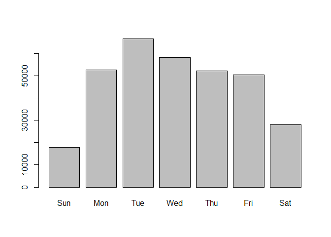

KickStarter - Post3
================
Tanner Martin
December 2, 2018

KICK STARTER - POST 3 - CLASSIFICATION AND VARIABLE SELECTION
-------------------------------------------------------------

IN THIS PROBLEM WE HAVE DATA ON APPROXIMATELY 380k KICKSTARTER PROJECTS. WE HAVE DATA ON NAME, CATEGORY, CURRENCY, DEADLINE, GOAL, LAUNCHED, PLEDGED, STATE(OR RESULT OF CAMPAIGN), BACKERS, COUNTRY, AND A FEW OTHER VARIABLES ABOUT MONEY WE WON'T USE. THE GOAL IS TO BUILD A CLASSIFICATION MODEL AND USE SOME FORM OF VARIABLE SELECTION (THROUGH DECISION TREE OR SOME OTHER METHOD) TO CHOOSE THE VARIABLES THAT WILL LEAD TO THE BEST PERFORMANCE.

``` r
ks <- read.csv("ks-projects-201801.csv")
table(ks$state)
```

    ## 
    ##   canceled     failed       live successful  suspended  undefined 
    ##      38779     197719       2799     133956       1846       3562

WE ONLY NEED THE ROWS WHERE THE CAMPAIGN IS EITHER FAILED OR SUCCESFUL (WHICH IS THE MAJORITY).

``` r
ks <- ks[which(ks$state=="failed" | ks$state == "successful"),]

length(which(ks$state=="failed"))/nrow(ks) #percent failed
```

    ## [1] 0.5961227

``` r
length(which(ks$state=="successful"))/nrow(ks) #percent successful
```

    ## [1] 0.4038773

NOW, WE WILL SELECT ONLY THE COLUMNS THAT WE WILL POTENTIALLY NEED IN BUILDING THE MODEL OR THAT WE WON'T TO USE FOR VARIABLE SELECTION.

``` r
ks <- ks[,c("category","main_category","currency","deadline","goal","launched","state","backers","country")]
```

HERE WE WILL DO EXPLORATORY ANALYSIS OF THE DATA TO SEE IF WE CAN GET A SENSE OF WHAT IS GOING ON BEFORE JUMPING RIGHT INTO BUILDING A MODEL.

``` r
summary(ks)
```

    ##            category           main_category       currency     
    ##  Product Design: 18680   Film & Video: 56527   USD    :261511  
    ##  Documentary   : 14523   Music       : 45949   GBP    : 29476  
    ##  Music         : 12633   Publishing  : 35445   EUR    : 14378  
    ##  Tabletop Games: 11744   Games       : 28521   CAD    : 12375  
    ##  Shorts        : 11394   Technology  : 27050   AUD    :  6621  
    ##  Food          : 10416   Art         : 25641   SEK    :  1510  
    ##  (Other)       :252285   (Other)     :112542   (Other):  5804  
    ##       deadline           goal                      launched     
    ##  8/8/2014 :   612   Min.   :        0   6/20/2017 16:00:    14  
    ##  8/10/2014:   480   1st Qu.:     2000   11/13/2013 0:02:     8  
    ##  8/7/2014 :   460   Median :     5000   10/4/2016 18:00:     6  
    ##  5/1/2015 :   419   Mean   :    44252   6/20/2017 16:02:     6  
    ##  8/9/2014 :   396   3rd Qu.:    15000   7/11/2014 21:14:     6  
    ##  7/1/2015 :   395   Max.   :100000000   7/11/2014 21:15:     6  
    ##  (Other)  :328913                       (Other)        :331629  
    ##         state           backers            country      
    ##  canceled  :     0   Min.   :     0.0   US     :261360  
    ##  failed    :197719   1st Qu.:     2.0   GB     : 29454  
    ##  live      :     0   Median :    15.0   CA     : 12370  
    ##  successful:133956   Mean   :   116.4   AU     :  6616  
    ##  suspended :     0   3rd Qu.:    63.0   DE     :  3436  
    ##  undefined :     0   Max.   :219382.0   FR     :  2520  
    ##                                         (Other): 15919

``` r
#THERE'S SOME GOALS THAT ARE VERY SMALL (BELOW $100). LET'S REMOVE THOSE.
ks <- ks[-which(ks$goal <= 100),]
hist(log(ks$goal)) #looks good let's go ahead and log
```


``` r
ks$log_goal <- log(ks$goal)

summary(ks$backers)
```

    ##    Min. 1st Qu.  Median    Mean 3rd Qu.    Max. 
    ##       0       2      15     118      64  219382

``` r
hist(ks$backers)
```


``` r
#lets log and add 1 so we don't log 0's
hist(log(ks$backers+1))
```


``` r
ks$log_backers <- log(ks$backers+1)
```

I WANT TO ADD IN A COLUMN THAT'S THE DIFFERENCE BETWEEN THE LAUNCH DATE AND THE DEADLINE (THE LENGTH OF THE CAMPAIGN IN TIME). ALSO, I WANT TO ADD A COLUMN THAT INCLUDES THE DAY OF THE WEEK THE CAMPAIGN WAS LAUNCHED AND THE DEADLINE DAY OF THE WEEK.

``` r
library(lubridate)
```

    ## 
    ## Attaching package: 'lubridate'

    ## The following object is masked from 'package:base':
    ## 
    ##     date

``` r
head(ks$launched)
```

    ## [1] 8/11/2015 12:12 9/2/2017 4:43   1/12/2013 0:20  3/17/2012 3:24 
    ## [5] 2/26/2016 13:38 12/1/2014 18:30
    ## 347035 Levels: 1/1/1970 1:00 1/1/2010 1:41 1/1/2010 16:36 ... 9/9/2017 8:52

``` r
head(ks$deadline)
```

    ## [1] 10/9/2015  11/1/2017  2/26/2013  4/16/2012  4/1/2016   12/21/2014
    ## 3164 Levels: 1/1/2010 1/1/2011 1/1/2012 1/1/2013 1/1/2014 ... 9/9/2017

``` r
launched <- mdy_hm(ks$launched)
deadline <- mdy(ks$deadline)

ks$launch_month <- month(launched, label = T)
ks$deadline_month <- month(deadline, label = T)
plot(ks$launch_month)
```


``` r
plot(ks$deadline_month)
```


``` r
ks$launch_day <- wday(launched, label = T)
ks$deadline_day <- wday(deadline, label=T)
plot(ks$launch_day)
```



``` r
plot(ks$deadline_day)
```


``` r
ks$launched <- sub(" .*", "", ks$launched)
ks$launched <- mdy(ks$launched)
ks$deadline <- mdy(ks$deadline)
ks$length_of_launch <- as.numeric(ks$deadline-ks$launched)
hist(ks$length_of_launch)
```


ONE OF THE VARIABLES WE'RE GOING TO USE HAS MORE THAN 53 LEVELS (NOT ACCEPTABLE FOR RANDOM FOREST). WE CAN COMBINE THE "RARE" LEVELS TO REDUCE THAT DOWN TO AN AMOUNT THAT MAKES SENSE FOR THE MODEL. ALTHOUGH WE ARE DEFINTILEY LOSING SOME INFORMATION, PREDICTIVE MODELING WILL NEVER BE PERFECT. HAVING A MODEL THAT'S FUNCTIONING AND GENERALIZES WELL IS BETTER THAN NOTHING AT ALL.

``` r
library(regclass)
```

    ## Loading required package: bestglm

    ## Loading required package: leaps

    ## Loading required package: VGAM

    ## Loading required package: stats4

    ## Loading required package: splines

    ## Loading required package: rpart

    ## Loading required package: randomForest

    ## randomForest 4.6-12

    ## Type rfNews() to see new features/changes/bug fixes.

    ## Important regclass change from 1.3:
    ## All functions that had a . in the name now have an _
    ## all.correlations -> all_correlations, cor.demo -> cor_demo, etc.

``` r
table(ks$category)
```

    ## 
    ##        3D Printing           Academic        Accessories 
    ##                565                760               2707 
    ##             Action            Animals          Animation 
    ##                607                211               2187 
    ##        Anthologies            Apparel               Apps 
    ##                721               6092               5241 
    ##       Architecture                Art          Art Books 
    ##                636               7185               2441 
    ##              Audio              Bacon              Blues 
    ##                354                117                233 
    ##          Calendars   Camera Equipment            Candles 
    ##                281                348                371 
    ##           Ceramics   Children's Books      Childrenswear 
    ##                271               6156                413 
    ##           Chiptune       Civic Design    Classical Music 
    ##                 30                264               2422 
    ##             Comedy        Comic Books             Comics 
    ##               2015               2396               4490 
    ##  Community Gardens     Conceptual Art          Cookbooks 
    ##                265                880                421 
    ##     Country & Folk            Couture             Crafts 
    ##               4194                226               3982 
    ##            Crochet              Dance             Design 
    ##                121               2209               3483 
    ##        Digital Art                DIY    DIY Electronics 
    ##               1084                965                783 
    ##        Documentary              Drama             Drinks 
    ##              14453               1892               2058 
    ##   Electronic Music         Embroidery             Events 
    ##               1863                 96                658 
    ##       Experimental  Fabrication Tools              Faith 
    ##                777                214                997 
    ##             Family            Fantasy   Farmer's Markets 
    ##                290                290                373 
    ##              Farms            Fashion          Festivals 
    ##               1037               7460                765 
    ##            Fiction       Film & Video           Fine Art 
    ##               7972               8486                648 
    ##             Flight               Food        Food Trucks 
    ##                348               9860               1566 
    ##           Footwear            Gadgets              Games 
    ##                780               2309               2564 
    ##    Gaming Hardware              Glass     Graphic Design 
    ##                282                121               1708 
    ##     Graphic Novels           Hardware            Hip-Hop 
    ##               1639               3104               3420 
    ##             Horror       Illustration          Immersive 
    ##               1070               2711                295 
    ##         Indie Rock      Installations Interactive Design 
    ##               5297                427                332 
    ##               Jazz            Jewelry         Journalism 
    ##               1740               1018               1517 
    ##               Kids           Knitting              Latin 
    ##                251                155                119 
    ##        Letterpress  Literary Journals    Literary Spaces 
    ##                 46                247                 18 
    ##         Live Games        Makerspaces              Metal 
    ##                853                207                629 
    ##        Mixed Media       Mobile Games     Movie Theaters 
    ##               2451               1401                200 
    ##              Music       Music Videos            Musical 
    ##              12466                614                822 
    ##     Narrative Film             Nature         Nonfiction 
    ##               4587                480               7360 
    ##           Painting             People    Performance Art 
    ##               2927                948               1936 
    ##       Performances        Periodicals        Pet Fashion 
    ##                950               1135                106 
    ##              Photo         Photobooks        Photography 
    ##                166               1407               5166 
    ##             Places      Playing Cards              Plays 
    ##                617               1975               1281 
    ##             Poetry                Pop            Pottery 
    ##               1203               3028                 85 
    ##              Print           Printing     Product Design 
    ##                600                187              18562 
    ##         Public Art         Publishing               Punk 
    ##               2798               4967                265 
    ##            Puzzles             Quilts                R&B 
    ##                193                 74                399 
    ##   Radio & Podcasts      Ready-to-wear        Residencies 
    ##                833                732                 68 
    ##        Restaurants             Robots               Rock 
    ##               2509                493               6199 
    ##            Romance    Science Fiction          Sculpture 
    ##                156                648               1624 
    ##             Shorts        Small Batch           Software 
    ##              11315               1463               2550 
    ##              Sound  Space Exploration             Spaces 
    ##                550                278                750 
    ##         Stationery     Tabletop Games          Taxidermy 
    ##                177              11475                 10 
    ##         Technology         Television           Textiles 
    ##               5678                861                246 
    ##            Theater          Thrillers       Translations 
    ##               6648                629                137 
    ##         Typography              Vegan              Video 
    ##                 93                521                375 
    ##          Video Art        Video Games          Wearables 
    ##                170               9150                961 
    ##            Weaving                Web          Webcomics 
    ##                 81               4226                586 
    ##          Webseries        Woodworking          Workshops 
    ##               5104               1035                147 
    ##        World Music        Young Adult              Zines 
    ##               1925                700                345

``` r
CL <- combine_rare_levels(ks$category, threshold = 2000)
length(levels(CL$values)) #good
```

    ## [1] 48

``` r
ks$category_comb <- CL$values
```

LET'S PROCEED WITH THE MODEL BUILDING PROCESS TO TRY OUT A COUPLE DIFFERENT METHODS THAT WILL ALSO SELECT VARIABLES FOR US.

``` r
model.data <- ks[,c("currency","state","country","log_goal",
                     "launch_month","deadline_month","launch_day",
                    "deadline_day","category_comb","length_of_launch")]

model.data$state <- droplevels(model.data$state)
```

NEXT, WE WILL SPLIT THE DATA INTO 70% TRAINING AND 30% TEST. ALSO, I'M GOING TO SAMPLE DOWN THE TEST AND TRAINING DATA TO MUCH SMALLER SAMPLE SIZES FOR EXAMPLE PURPOSES.

``` r
train.rows <- sample(1:nrow(ks), size=nrow(ks)*.7, replace = F)
train <- model.data[train.rows,]
test <- model.data[-train.rows,]

colnames(ks)[colSums(is.na(ks)) > 0] #no missing data
```

    ## character(0)

``` r
set.seed(400)
mini_train <- train[sample(1:nrow(train),size=nrow(train)*.4,replace = F),]
mini_test <- test[sample(1:nrow(test), size=nrow(test)*.4,replace = F),]
```

HERE I AM GOING TO FIT A MODEL ON MINI TRAIN, CALCULATE AND LOOK AT IT'S AUC AND HOW IT GENERALIZES TO KNEW DATA (MINI\_TEST). ADDITIONALLY, WE'LL TAKE A LOOK AT THE VARIABLE IMPORTANCE. THIS PLOT TELLS US WHAT VARIABLES THE RANDOM FOREST MODEL "CHOSE" (AND ARE THEREFORE IMPORTANT) TO MAKE IT'S PREDICTIONS OF WHETHER A KICKSTARTER CAMPAIGN WILL BE SUCCESSFUL OR NOT.

``` r
fit <- randomForest(state~.,data = mini_train)

library(pROC)
```

    ## Warning: package 'pROC' was built under R version 3.4.4

    ## Type 'citation("pROC")' for a citation.

    ## 
    ## Attaching package: 'pROC'

    ## The following objects are masked from 'package:stats':
    ## 
    ##     cov, smooth, var

``` r
rf.roc.train <-roc(mini_train$state,fit$votes[,2])
plot(rf.roc.train)
```


``` r
auc(rf.roc.train)
```

    ## Area under the curve: 0.6172

``` r
#test predictions
predictions <- predict(fit, newdata = mini_test, type="prob")[,2]
rf.roc.test <- roc(mini_test$state,predictions)
auc(rf.roc.test)
```

    ## Area under the curve: 0.6181

IT LOOKS LIKE THE MODEL HAS GENERALIZED PRETTY WELL TO NEW DATA. THE AUC ON THE TRAINING DATA WAS 0.6161 WHEN DEPLOYED ON THE TEST DATA, IT'S NOW 0.6219 IT'S ACTUALLY BETTER! IF WE WOULD HAVE SEEN AN AUC ON THE TEST SET OF .55 (OR SOMETHING LIKE THAT), THEN THAT WOULD INDICATE OUR MODEL IS OVERFIT. AN AUC OF .64 TELL US THE FOLLOWING: GIVEN TO RANDOM INSTANCES (ONE WHERE THE KS CAMPAIGN WAS SUCCESFUL AND ONE WHERE IT FAILED), OUR MODEL WOULD CORRECTLY CLASSIFY THESE 64% OF THE TIME.

HOW VARIABLE SELECTION WORKS IN RANDOM FOREST:

RANDOM FOREST MODELS ARE COMMONLY USED FOR VARIABLE SELECTION IN PRACTICE. THIS IS BECAUSE THE TREE-BASED METHOD USED NATURALLY RANKS BY HOW WELL THEY IMPROVE THE "PURITY" OF THE NODE. PURITY IS HOW MUCH THE MAJORITY OF ONE CLASS OR THE OTHER IMPROVES - IN SIMPLE TERMS, THE MORE PURE A SPLIT MAKES THE CLASSES IN THE NODE, THE HIGHER THE PURITY. NODES WITH THE BIGGEST DECREASE IN IMPURITY OCCUR AT THE BEGINNING OF THE TREES. PRUNING TREES BELOW A CERTAIN NODE, WE CAN CREATE A SUBSET OF THE MOST "IMPORTANT" VARIABLES.

``` r
varImpPlot(fit)
```


THE CATEGORY OF THE CAMPAIGN IS THE MOST IMPORTANT OF ALL THE POTENTIAL VARIABLES (PERHAPS CERTAIN PRODUCT CATEGORIES ARE MORE VIRAL THAN OTHERS). IT LOOKS LIKE THE GOAL OF THE CAMPAIGN IS A BIG FACTOR IN SUCCESS. THIS MAKES SENSE BECAUSE MORE LOFTY GOALS ARE PROBABLY LESS LIKELY TO BE SUCCESSFUL. SETTING YOUR GOAL NUMBER IS DEFINITELY AN IMPORTANT FACTOR WHEN MAKING A NEW CAMPAIGN. THE TWO VARIABLES PREVIOUSLY MENTIONED ARE BY FAR THE TWO MOST "IMPORTANT" IN CORRECLTY PREDICTING CAMPAIGN SUCCESS. THE LENGTH OF LAUNCH, LAUNCH MONTH, DEADLINE MONTH, DEADLINE DAY, AND LAUNCH DAY ARE ALL VERY COMPARABLE IN IMPORTANCE. WE COULD POTENTIALLY TAKE OUT COUNTRY AND CURRENCY AND SEE HOW THE PERFORMANCE HOLDS UP WITHOUT THESE TWO BECAUSE A SIMPLER MODEL (LESS VARIABLES) IS ALWAYS PREFERRED.

``` r
model.data <- ks[,c("state","log_goal",
                     "launch_month","deadline_month","launch_day",
                    "deadline_day","category_comb","length_of_launch")]

model.data$state <- droplevels(model.data$state)

fit <- randomForest(state~.,data = mini_train)

library(pROC)
rf.roc.train <-roc(mini_train$state,fit$votes[,2])
plot(rf.roc.train)
```


``` r
auc(rf.roc.train)
```

    ## Area under the curve: 0.616

``` r
#test predictions
predictions <- predict(fit, newdata = mini_test, type="prob")[,2]
rf.roc.test <- roc(mini_test$state,predictions)
auc(rf.roc.test)
```

    ## Area under the curve: 0.6168

SURPRISINGLY, THE PERFORMANCE DIDN'T REALLY CHANGE MUCH AT ALL. THIS IS A GOOD THING! I WOULD SAY WE COULD COMFORTABLY REMOVE THOSE TWO VARIABLES TO DECREASE THE COMPLEXITY AND INCREASE THE INTERPRETABILITY OF THE MODEL.
